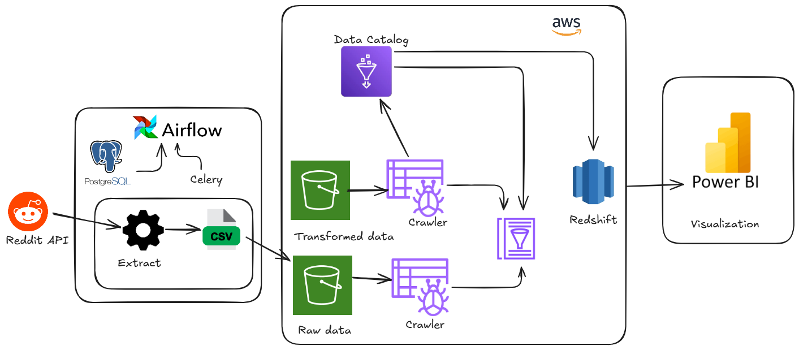

# TechPulse

TechPulse is a high-standard data pipeline that automates the extraction, processing, storage, and analysis of technology news from Reddit. It integrates with AWS services to ensure scalability, reliability, and efficiency.




## Features
- **Automated Data Extraction**: Uses PRAW (Python Reddit API Wrapper) to fetch top posts from the technology subreddit.
- **Data Cleaning & Transformation**: Standardizes and refines data for better quality.
- **Storage & Processing**: Saves data to Amazon S3, enabling further transformations using AWS Glue.
- **Orchestration**: Apache Airflow manages the pipeline, automating each step.
- **Data Warehousing**: Loads cleaned and transformed data into Amazon Redshift for analysis.
- **Final Visualization**: Enables data-driven insights using BI tools like Tableau or Power BI.

## Setup & Installation
### Prerequisites
- **Docker & Docker Compose**: To run Apache Airflow.
- **AWS Account**: To use S3, Glue, and Redshift.
- **Python**

### Steps to Run
1. Clone the repository:
   ```bash
   git clone https://github.com/King-04/tech_pulse.git
   cd techpulse
   ```
2. Install Dependencies:
   ```bash
   pip install -r requirements.txt
   ```
3. Configure .env with Reddit API and AWS credentials.


4. Start Airflow
   ```bash
   docker-compose up -d
   ```
5. Monitor pipeline execution in the Airflow UI (http://localhost:8080).


## AWS Configuration (Next Steps)

The remaining configurations in AWS include:

- **AWS Glue Crawler**: Set up a crawler to scan S3 and create a metadata catalog.
- **AWS Glue ETL Job**: Define and run an ETL job to transform data for Redshift.
- **Amazon Redshift**: Configure a Redshift cluster and load transformed data.
- **Final Visualization**: Use Tableau or a BI tool to analyze and visualize insights.

These steps will be configured in AWS to complete the pipeline.
